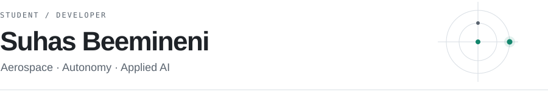

<picture>
  <source media="(prefers-color-scheme: dark)" srcset="assets/profile-header.svg">
  
</picture>

I'm **Suhas Beemineni**, a high school student focused on aerospace, autonomous systems, and reliable AI. I build research tools and practical applications, with an emphasis on reproducible experiments, clear limitations, and useful interfaces.

**[Portfolio](https://suhaslord.github.io/portfolio/)** · [LinkedIn](https://www.linkedin.com/in/suhas-beemineni-1984763b8/) · [Open-source contributions](https://github.com/pulls?q=is%3Apr+author%3Asuhaslord+is%3Amerged)

## Featured work

### [AegisLand — UAV Safety Research](https://github.com/suhaslord/uav-safety-research)

Simulation research into unreliable landing-camera estimates, uncertainty calibration, and transfer to new synthetic contexts. The research record extends through Phase 22 and preserves both successful and failed evaluations. Results are simulation evidence, not validation for physical flight.

[Research cockpit](https://aegisland-research-cockpit.vercel.app/) · [Phase archive](https://aegisland-research-cockpit.vercel.app/phases/) · [Code and reproduction](https://github.com/suhaslord/uav-safety-research#how-to-run-aegisland)

### [Portfolio — Projects and Engineering Work](https://github.com/suhaslord/portfolio)

A static portfolio bringing together spacecraft simulation, AI evaluation, research, and creative software. Case studies link to code, experimental records, and contributions.

[Visit the portfolio](https://suhaslord.github.io/portfolio/)

## More projects

- **[TennisRank](https://github.com/suhaslord/tennisrank-ai)** — Team rankings, spreadsheet imports, and an authenticated tennis challenge ladder with coach approval and rank history.
- **[AbstainBench](https://github.com/suhaslord/AbstainBench)** — A 30-question browser experiment in answering versus abstaining, with an offline baseline and optional local WebLLM inference.
- **[ECHO / FIELD](https://github.com/suhaslord/ECHO-FIELD)** — A generative Canvas instrument shaped by pointer movement, microphone input, and seeded memory.
- **[Citizen-Science Astronomy Lab](https://github.com/suhaslord/citizen-science-astronomy-lab)** — Reproduction of known exoplanet signals and sample-data photometry using public astronomy datasets.
- **[Pacific Climate Dataviz](https://github.com/suhaslord/pacific-climate-dataviz)** — Reproducible visualization of Pacific sea-surface temperature anomalies, with data provenance and method notes.

## Engineering and open source

My work with **Seagulls / OpenStage** has focused on model routing, memory boundaries, and QA.

Selected merged contributions:

- **[NASA · python_cmr](https://github.com/nasa/python_cmr/pull/119)** — Support for searching satellite metadata across multiple platforms.
- **[OpenMDAO · Aviary](https://github.com/OpenMDAO/Aviary/pull/1262)** — A minimal FLOPS aircraft example.
- **[OpenC3 · COSMOS](https://github.com/OpenC3/cosmos/pull/3720)** — Received-time support for injected telemetry.
- **[GTSAM](https://github.com/borglab/gtsam/pull/2680)** — Documentation of IMU integration covariance.
- **[PACK Lab](https://github.com/pack-lab/Non_Cooperative_Driving_Suhas/pull/1)** — A mixed-motive driving baseline and CARLA adapter.

## Technical interests

Spacecraft dynamics and navigation · Perception uncertainty · AI evaluation · Scientific visualization

**Tools:** Python, JavaScript, NumPy, Matplotlib, and Git.

River Islands High School · Delta College coursework
