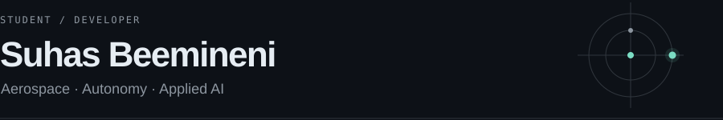

I'm a high school student working on aerospace, autonomy, and applied AI. I like turning research questions into code I can test.

[Portfolio](https://suhaslord.github.io/portfolio/) · [LinkedIn](https://www.linkedin.com/in/suhas-beemineni-1984763b8/)

## What I'm researching

- **Navigation & controls** — Lunar optical navigation, attitude estimation, and spacecraft dynamics.
- **Autonomy** — Reliable landing perception and cooperative vs. non-cooperative driving.
- **AI reliability** — Model routing, uncertainty, and knowing when a model should abstain.
- **Satellite data** — Astronomy and climate studies using public datasets.

## Where I've contributed

**Seagulls / OpenStage** · AI engineering intern working on model routing, memory boundaries, and QA.

Selected merged open-source contributions:

| Project | My contribution |
| --- | --- |
| [NASA · python_cmr](https://github.com/nasa/python_cmr/pull/119) | Multi-platform satellite-data queries |
| [OpenMDAO · Aviary](https://github.com/OpenMDAO/Aviary/pull/1262) | A minimal aircraft example and validation |
| [OpenC3 · COSMOS](https://github.com/OpenC3/cosmos/pull/3720) | Historical telemetry timestamps |
| [GTSAM](https://github.com/borglab/gtsam/pull/2680) | IMU uncertainty documentation |
| [PACK Lab](https://github.com/pack-lab/Non_Cooperative_Driving_Suhas/pull/1) | Driving-policy baseline and CARLA adapter |

## Things I've built

- **[AegisLand](https://github.com/suhaslord/uav-safety-research)** — Testing how to catch camera errors during autonomous landing.
- **[AbstainBench](https://github.com/suhaslord/AbstainBench)** — Testing when language models should answer or abstain.
- **[TennisRank](https://github.com/suhaslord/tennisrank-ai)** — Singles and doubles rankings for a tennis team.
- **[ECHO / FIELD](https://github.com/suhaslord/ECHO-FIELD)** — A visual instrument driven by sound and motion.

**Tools:** Python · JavaScript · NumPy · Matplotlib · Git

River Islands High School · Delta College coursework · SkillsUSA regional champion in 3D Visualization & Animation

## GitHub activity

<picture>
  <source media="(prefers-color-scheme: dark)" srcset="https://github-profile-summary-cards.vercel.app/api/cards/profile-details?username=suhaslord&amp;theme=github_dark">
  
</picture>

[Commits](https://github.com/search?q=author%3Asuhaslord&type=commits) · [Pull requests](https://github.com/pulls?q=is%3Apr+author%3Asuhaslord)
